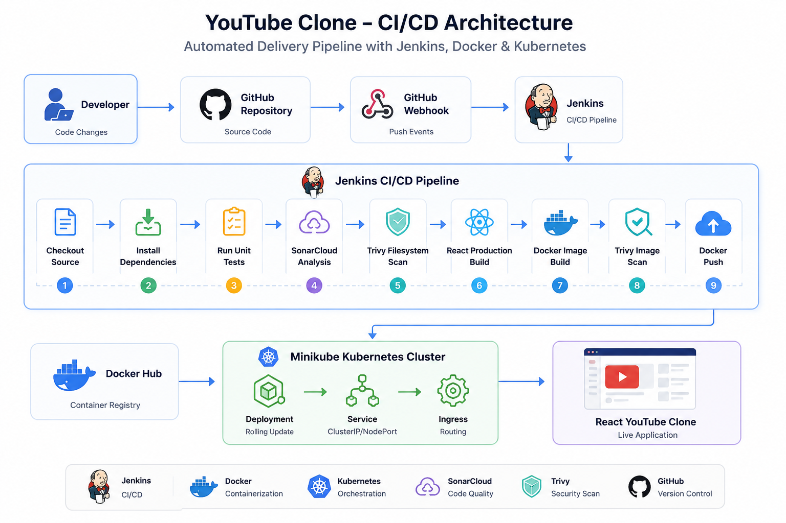
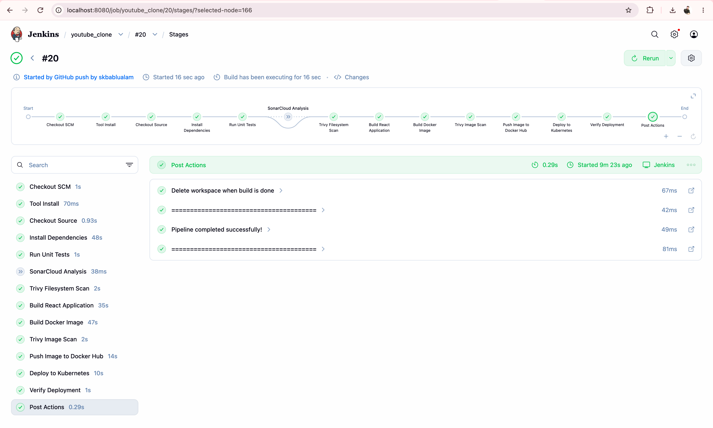
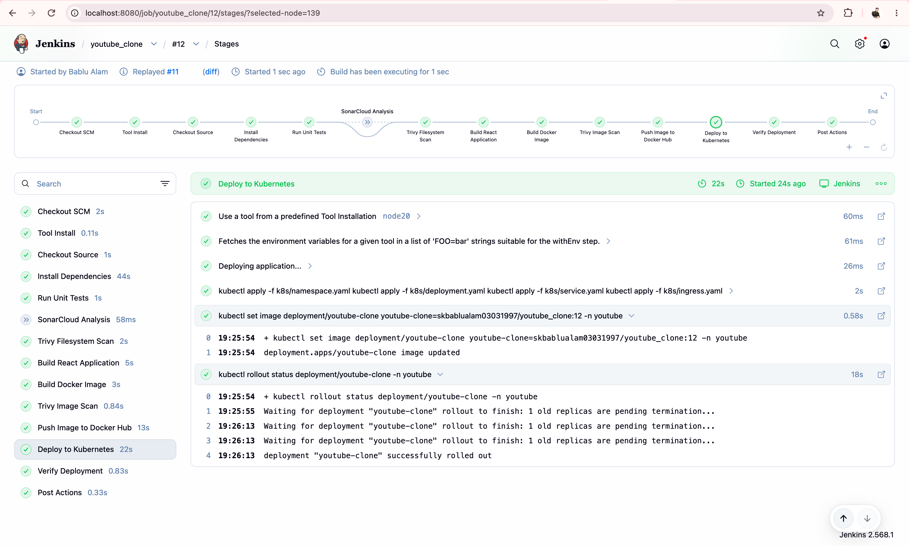
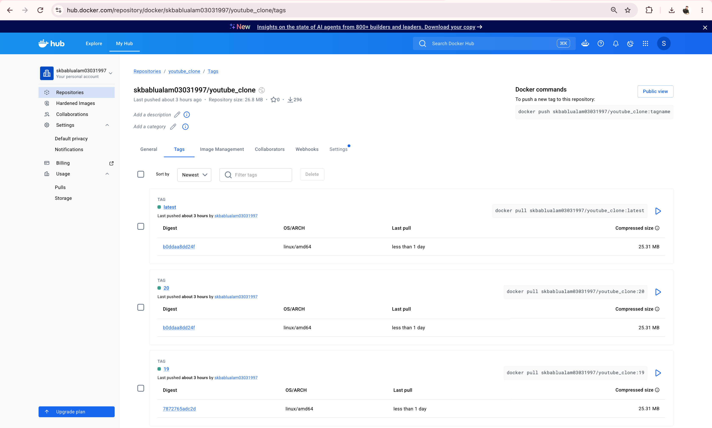

<div align="center">

# 🎬 YouTube Clone

### 🚀 Enterprise DevOps CI/CD Pipeline Project

<p>
A production-inspired <b>YouTube Clone</b> built with <b>React.js</b> and automated using a complete <b>DevOps CI/CD pipeline</b> powered by <b>Jenkins</b>, <b>Docker</b>, <b>Docker Hub</b>, <b>Kubernetes (Minikube)</b>, <b>SonarCloud</b>, and <b>Trivy</b>.
</p>


<br>


</div>

---

# 📑 Table of Contents

- [Project Overview](#-project-overview)
- [Architecture](#-architecture)
- [Project Workflow](#-project-workflow)
- [Key Features](#-key-features)
- [Technology Stack](#-technology-stack)
- [Repository Structure](#-repository-structure)
- [Prerequisites](#-prerequisites)
- [Installation Guide](#-installation-guide)

---

# 📖 Project Overview

This project demonstrates how a modern React application can be deployed using a complete DevOps workflow.

Instead of manually building and deploying the application, the entire software delivery process has been automated using Jenkins CI/CD.

Whenever code is pushed to GitHub:

- GitHub Webhook automatically triggers Jenkins
- Jenkins builds the application
- Unit tests are executed
- SonarCloud performs static code analysis
- Trivy scans the project and Docker image for vulnerabilities
- Docker builds the production image
- Docker image is pushed to Docker Hub
- Kubernetes automatically deploys the latest image to Minikube
- Rolling updates ensure zero downtime deployment

This repository is designed to showcase real-world DevOps practices suitable for interviews, portfolio demonstrations, and production-inspired workflows.

---

# 🏗 Architecture

<p align="center">

</p>

### Architecture Workflow

```text
Developer
     │
GitHub Repository
     │
GitHub Webhook
     │
Jenkins CI/CD Pipeline
     │
──────────────────────────────────────
Checkout Source
Install Dependencies
Run Unit Tests
SonarCloud Analysis
Trivy Filesystem Scan
React Production Build
Docker Image Build
Trivy Image Scan
Docker Push
──────────────────────────────────────
     │
Docker Hub
     │
Minikube Kubernetes Cluster
     │
Deployment
     │
Service
     │
React YouTube Clone
```

---

# 🔄 Project Workflow

```text
Code Push
    │
    ▼
GitHub Repository
    │
Webhook
    │
    ▼
Jenkins
    │
Checkout
    │
npm install
    │
Unit Test
    │
SonarCloud
    │
Trivy Scan
    │
React Build
    │
Docker Build
    │
Docker Push
    │
Kubernetes Deployment
    │
Rolling Update
    │
Application Ready
```

---

# ✨ Key Features

- 🎬 Responsive React YouTube Clone
- 🔍 Search videos using RapidAPI
- 📺 Embedded video player
- 🎨 Material UI interface
- 🐳 Multi-stage Docker build
- 🚀 Automated Jenkins CI/CD Pipeline
- 🔄 GitHub Webhook Integration
- ☸ Kubernetes Deployment (Minikube)
- 📦 Docker Hub Integration
- 🔒 Trivy Security Scanning
- 📈 SonarCloud Code Quality Analysis
- ⚡ Automated Rolling Updates
- 🌐 Nginx Production Server
- 📝 Enterprise Documentation

---

# 🛠 Technology Stack

| Category | Technology |
|----------|------------|
| Frontend | React.js |
| Styling | Material UI |
| Package Manager | npm |
| Web Server | Nginx |
| Containerization | Docker |
| Container Registry | Docker Hub |
| CI/CD | Jenkins |
| Source Code | GitHub |
| Code Quality | SonarCloud |
| Security Scan | Trivy |
| Container Orchestration | Kubernetes |
| Local Cluster | Minikube |
| API | YouTube v3 RapidAPI |
| OS | Ubuntu Linux |

---

# 📂 Repository Structure

```text
youtube_clone/
│
├── public/
│
├── src/
│   ├── components/
│   ├── utils/
│   ├── App.js
│   ├── index.js
│   └── index.css
│
├── k8s/
│   ├── namespace.yaml
│   ├── deployment.yaml
│   ├── service.yaml
│   └── ingress.yaml
│
├── scripts/
│   ├── install-jenkins.sh
│   ├── deploy.sh
│   └── rollback.sh
│
├── docs/
│   ├── Architecture.md
│   ├── CI-CD.md
│   ├── Kubernetes.md
│   └── Terraform.md
│
├── images/
│   ├── architecture.png
│   ├── demo.gif
│   ├── app-home.png
│   ├── jenkins-pipeline.png
│   ├── kubernetes.png
│   └── dockerhub.png
│
├── Dockerfile
├── Jenkinsfile
├── package.json
├── README.md
└── .dockerignore
```

---

# 📋 Prerequisites

Before running this project, install the following software:

| Software | Version |
|----------|----------|
| Node.js | 20+ |
| npm | Latest |
| Docker Desktop | Latest |
| Kubernetes CLI | kubectl |
| Minikube | Latest |
| Git | Latest |
| Jenkins | LTS |
| Docker Hub Account | Required |
| GitHub Account | Required |
| RapidAPI Account | Required |
| SonarCloud Account | Optional |

---

# 🚀 Installation Guide

## 1️⃣ Clone the Repository

```bash
git clone https://github.com/<your-github-username>/youtube_clone.git

cd youtube_clone
```

---

## 2️⃣ Install Dependencies

```bash
npm install
```

---

## 3️⃣ Configure RapidAPI

Create a `.env` file in the project root.

```env
REACT_APP_RAPID_API_KEY=YOUR_RAPID_API_KEY
```

---

## 4️⃣ Start Local Development

```bash
npm start
```

Application:

```
http://localhost:3000
```

---

## 5️⃣ Build Production Version

```bash
npm run build
```

The optimized production build will be generated inside the `build/` directory.

---

## 6️⃣ Build Docker Image

```bash
docker build \
-t youtube-clone:latest \
.
```

---

## 7️⃣ Run Docker Container

```bash
docker run -d \
-p 80:80 \
youtube-clone:latest
```

Application:

```
http://localhost
```

---

## 8️⃣ Start Minikube

```bash
minikube start \
--driver=docker \
--cpus=2 \
--memory=4096
```

Enable Ingress:

```bash
minikube addons enable ingress
```

---

## 9️⃣ Deploy to Kubernetes

```bash
kubectl apply -f k8s/namespace.yaml

kubectl apply -f k8s/deployment.yaml

kubectl apply -f k8s/service.yaml

kubectl apply -f k8s/ingress.yaml
```

Verify:

```bash
kubectl get all -n youtube
```

---
---

# ⚙️ Jenkins CI/CD Pipeline

This project uses a **Declarative Jenkins Pipeline** to automate the complete software delivery lifecycle.

Whenever new code is pushed to the GitHub repository, Jenkins automatically performs the following tasks:

- Checkout source code
- Install project dependencies
- Execute unit tests
- Perform SonarCloud code analysis
- Run Trivy filesystem scan
- Build React production application
- Build Docker image
- Scan Docker image using Trivy
- Push Docker image to Docker Hub
- Deploy latest image to Kubernetes
- Verify deployment

---

# 🔄 CI/CD Workflow

```text
Developer
      │
Git Push
      │
GitHub Repository
      │
GitHub Webhook
      │
Jenkins
      │
──────────────────────────────
Checkout Source
Install Dependencies
Run Unit Tests
SonarCloud Analysis
Trivy Filesystem Scan
React Production Build
Docker Image Build
Trivy Image Scan
Docker Push
Deploy to Kubernetes
Verify Deployment
──────────────────────────────
      │
Docker Hub
      │
Minikube
      │
Kubernetes
      │
React YouTube Clone
```

---

# 📦 Jenkins Pipeline Stages

| Stage | Description |
|---------|-------------|
| Checkout | Pull latest source code |
| Install Dependencies | Install npm packages |
| Unit Test | Execute React unit tests |
| SonarCloud | Static code quality analysis |
| Trivy Filesystem Scan | Scan project files for vulnerabilities |
| Build React | Generate optimized production build |
| Docker Build | Build Docker image |
| Trivy Image Scan | Scan Docker image |
| Docker Push | Push image to Docker Hub |
| Deploy | Apply Kubernetes manifests |
| Verify | Verify Pods & Services |

---

# 📷 Jenkins Pipeline Screenshot

<p align="center">



</p>

---

# 🐳 Docker

The application uses a **multi-stage Docker build**.

## Stage 1

- Node.js 20
- Install Dependencies
- React Production Build

## Stage 2

- Nginx
- Copy production build
- Serve static files

Benefits:

- Smaller image
- Faster deployment
- Production ready
- Better security
- Reduced attack surface

---

# 📦 Docker Hub

After the Docker image is successfully built, Jenkins automatically pushes it to Docker Hub.

Example:

```bash
docker login

docker build -t bablualam/youtube-clone:latest .

docker push bablualam/youtube-clone:latest
```

Docker Hub Repository

```
https://hub.docker.com/r/skbablualam03031997/youtube_clone
```

---

# ☸ Kubernetes Deployment

Deployment is completely automated through Jenkins.

Resources deployed:

- Namespace
- Deployment
- Service
- Ingress

Deployment Strategy

- Rolling Update
- Zero Downtime
- Automatic Image Update

Deploy manually:

```bash
kubectl apply -f k8s/
```

---

# 🔍 Verify Deployment

Check Pods

```bash
kubectl get pods -n youtube
```

Check Services

```bash
kubectl get svc -n youtube
```

Check Deployment

```bash
kubectl get deployment -n youtube
```

Describe Pod

```bash
kubectl describe pod <pod-name> -n youtube
```

View Logs

```bash
kubectl logs <pod-name> -n youtube
```

---

# 🔗 GitHub Webhook Configuration

To enable automatic deployments, configure GitHub Webhooks.

Expose Jenkins using ngrok:

```bash
ngrok http 8080
```

GitHub Repository

```
Settings

↓

Webhooks

↓

Add Webhook
```

Payload URL

```
https://your-ngrok-url.ngrok-free.app/github-webhook/
```

Content Type

```
application/json
```

Event

```
Push Event
```

Now every push automatically triggers Jenkins.

---

# 🔐 SonarCloud Integration

The Jenkins pipeline performs static code analysis using SonarCloud.

Features

- Code Smells
- Bugs
- Vulnerabilities
- Maintainability Rating
- Reliability Rating
- Security Rating

Store the SonarCloud Token securely in Jenkins Credentials.

---

# 🛡 Trivy Security Scanning

Two security scans are performed.

### Filesystem Scan

```bash
trivy fs .
```

### Docker Image Scan

```bash
trivy image youtube-clone:latest
```

This helps detect:

- High severity vulnerabilities
- Critical vulnerabilities
- Misconfigurations
- Secrets

---

# 📸 Project Screenshots

## 🏠 Application

<p align="center">


</p>

---

## 🚀 Jenkins Pipeline

<p align="center">


</p>

---

## ☸ Kubernetes Cluster

<p align="center">



</p>

---

## 📦 Docker Hub Repository

<p align="center">



</p>

---

# 🎥 Project Demo

A complete walkthrough of the project demonstrating:

- React Application
- Search Videos
- Video Playback
- GitHub Push
- Jenkins Pipeline
- Docker Build
- Docker Push
- Kubernetes Deployment

---

# 🩺 Troubleshooting

## Docker Build Fails

```bash
docker system prune -a
```

---

## Kubernetes Pod CrashLoopBackOff

```bash
kubectl logs POD_NAME -n youtube
```

---

## ImagePullBackOff

Ensure the image exists on Docker Hub.

```bash
docker push bablualam/youtube-clone:latest
```

---

## Jenkins Webhook Not Triggering

Verify:

- GitHub Webhook
- ngrok URL
- Jenkins GitHub Plugin

---

## React Refresh Returns 404

Ensure Nginx configuration contains:

```nginx
try_files $uri $uri/ /index.html;
```

---

## RapidAPI Not Working

Verify:

```
REACT_APP_RAPID_API_KEY
```

inside

```
.env
```

---

# 🎯 DevOps Concepts Demonstrated

✅ CI/CD Pipeline

✅ Jenkins

✅ GitHub Webhooks

✅ Docker

✅ Docker Hub

✅ Kubernetes

✅ Rolling Updates

✅ Nginx

✅ SonarCloud

✅ Trivy

✅ Infrastructure Automation

✅ Linux

---

# 📚 Learning Outcomes

This project demonstrates practical experience with:

- CI/CD Automation
- Containerization
- Kubernetes Deployments
- Docker Image Management
- Security Scanning
- Static Code Analysis
- GitHub Integration
- Production Build Optimization
- Nginx Configuration
- Rolling Updates

---

# ❓ Interview Questions

Some common interview topics based on this project:

1. Why Jenkins instead of GitHub Actions?
2. Why Docker Multi-stage Build?
3. Why Kubernetes Deployment instead of Docker Run?
4. What is Rolling Update?
5. What is ImagePullPolicy?
6. How does GitHub Webhook work?
7. Why use Docker Hub?
8. What is SonarCloud?
9. What is Trivy?
10. Difference between Pod and Deployment?
11. Difference between Service and Ingress?
12. Why Nginx?
13. How does Jenkins Pipeline work?
14. How would you rollback a deployment?
15. How do you troubleshoot a failed Pod?

---

# 🚀 Future Enhancements

- Deploy to Amazon EKS
- Provision Infrastructure using Terraform
- Configure AWS Application Load Balancer
- Add HTTPS using ACM
- Deploy using Helm Charts
- GitOps with Argo CD
- Horizontal Pod Autoscaler (HPA)
- Canary Deployment Strategy
- Blue-Green Deployment
- Integration Testing
- Slack Notifications
- Email Notifications

---

# 🤝 Contributing

Contributions are welcome!

1. Fork the repository

2. Create a feature branch

```bash
git checkout -b feature/new-feature
```

3. Commit your changes

```bash
git commit -m "Add new feature"
```

4. Push to GitHub

```bash
git push origin feature/new-feature
```

5. Open a Pull Request

---

# 👨‍💻 Author

## Bablu Alam

**Cloud / DevOps Engineer | AWS | Kubernetes | Docker | Jenkins | Terraform | Linux**

GitHub

```
https://github.com/skbablualam
```

LinkedIn

```
https://www.linkedin.com/in/bablu-alam/
```

Portfolio

```
https://skbablualam.github.io/
```

If you found this project helpful, don't forget to ⭐ star the repository!

---

# 📄 License

This project is licensed under the **MIT License**.

Feel free to use, modify, and distribute this project for learning and educational purposes.

---

<div align="center">

## ⭐ If you like this project, please consider giving it a Star!

**Made with ❤️ by Bablu Alam**

</div>