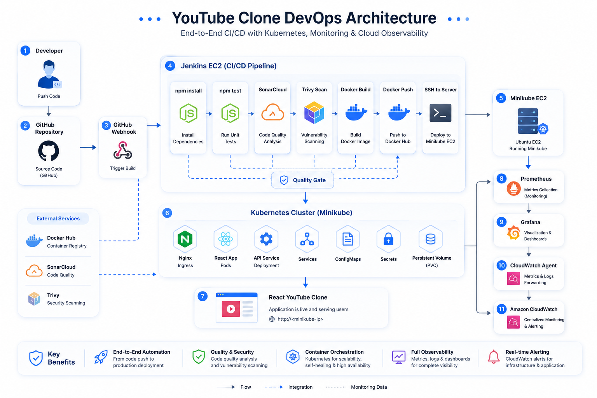
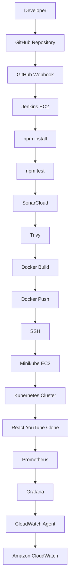

# Architecture


```text
Developer
     │
     ▼
GitHub Repository
     │
     ▼
GitHub Webhook
     │
     ▼
Jenkins EC2
     │
     ├── npm install
     ├── npm test
     ├── SonarCloud
     ├── Trivy
     ├── Docker Build
     ├── Docker Push
     └── SSH
             │
             ▼
       Minikube EC2
             │
             ▼
      Kubernetes Cluster
             │
             ▼
      React YouTube Clone
             │
             ▼
       Prometheus
             │
             ▼
         Grafana
             │
             ▼
      CloudWatch Agent
             │
             ▼
      Amazon CloudWatch
```
# Project Architecture


